# Complexity

Visual comparison of all 19 sorting algorithms in ordinex.

**Scale** — Big-O classes mapped to an ordinal axis:

| Value | Complexity |
|---|---|
| 1 | O(1) |
| 2 | O(log n) |
| 3 | O(n) |
| 4 | O(n log n) |
| 5 | O(n²) |
| 6 | O(n·n!) |
| 7 | O(∞) / O($) / O(☁) |

```mermaid
xychart-beta
    title "Complexity at a glance"
    x-axis [Bubble, Insertion, Selection, Cocktail, Gnome, Shell, Quick, Merge, Heap, Counting, Radix, Bucket, Pancake, Bogo, Sleep, Miracle, Thanos, Vibe, Stalin]
    y-axis "Complexity class" 0 --> 7
    bar [5, 5, 5, 5, 5, 5, 4, 4, 4, 3, 3, 3, 5, 6, 3, 7, 3, 7, 3]
    bar [5, 5, 5, 5, 5, 5, 5, 4, 4, 3, 3, 5, 5, 7, 3, 7, 3, 7, 3]
    line [1, 1, 1, 1, 1, 1, 2, 3, 1, 3, 3, 3, 1, 1, 3, 1, 3, 7, 3]
```

> **Bars** — Time avg · Time worst &nbsp;|&nbsp; **Line** — Space
